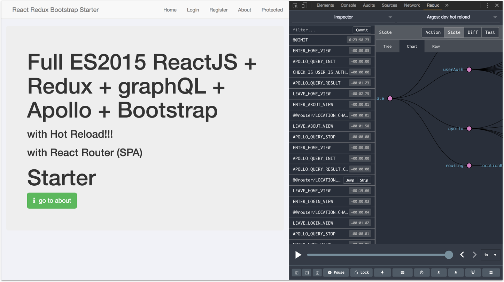

Full ES6+ React + React-Router + Redux + GraphQL + Apollo + Bootstrap with Hot Reload and redux-devtools STARTER
==========

<a target='_blank' rel='nofollow' href='https://app.codesponsor.io/link/Mp96tCWH2KdajZuBzqB6jwj8/MacKentoch/react-redux-graphql-apollo-bootstrap-webpack-starter'>
  
</a>

> My new `React + redux project starter`. This time I add `graphQL` and `Apollo Client`.
This starter also embeds `JWT token based` `authentication` (check [Route](https://github.com/MacKentoch/react-redux-graphql-apollo-bootstrap-webpack-starter/blob/master/src/app/routes/MainRoutes.js#L29) to get an example of dealing with protected routes).




- *webpack is as simple as possible*
- *ReactJS is written with `optimization tricks` (stateless, pure render...).*
- *`pure front-end` = server independant (use whatever you want as server: NodeJS, Rails, .NET...)*
- *`redux` + `devTools` + `hot reload`= how did I developed without them before?*
- *graphQL makes API to be " `has been` "*
 - *no more struggle in redux with async thank to Apollo Client (you can even get rid of redux thunk or redux saga if you needed theses just for your asyncs. Otherwise keep them since they are nice :smile:)*
- [redux-devtools-extension](https://github.com/zalmoxisus/redux-devtools-extension#redux-devtools-extension) to make developments a pure pleasure.


## Detailed Content

**Front:**
- React JS (15.6.x - [github :link:](https://github.com/facebook/react))
- Redux (*as you application grows managing state will be a serious concern, save pain with Redux*)
- apollo-client 1.9.x (*futur of API. Learn about this beast [here in officiel website](http://dev.apollodata.com/)*)
- React-Redux 3.7.x (*Redux is not specific to ReactJS, you could easily use it with Angular2 for instance*)
- React-Router-Redux (*previously named react-simple-router*)
- react-router (4.x- [github :link:](https://github.com/reactjs/react-router))
- Bootstrap (3.x - [github :link:](https://github.com/twbs/bootstrap))
- React-Bootstrap ([github :link:](https://github.com/react-bootstrap/react-bootstrap))
- font-awesome ([github :link:](https://github.com/FortAwesome/Font-Awesome))
- animate.css ([github :link:](https://github.com/daneden/animate.css))
- classnames ([github :link:](https://github.com/JedWatson/classnames))
- react-motion ([github :link:](https://github.com/chenglou/react-motion))
- Webpack 3.x ([github :link:](https://github.com/webpack/webpack))
- postcss
- babel 6+ ([github :link:](https://github.com/babel/babel))
- redux-devtool-extension ([github :link:](https://github.com/zalmoxisus/redux-devtools-extension#redux-devtools-extension))

**Tool chain:**
- babel 6+
- eslint
- hot reload
- loaders
  - `js` / `jsx`
  - sass
  - css
  - json
  - images formats
  - svg and fonts formats

**tests:**
- Mocha
- Chai (*+ dirty-chai*)
- enzyme
- Sinon
- nyc


## Usage

### Prerequisite

#### Node JS version required is `>=6.x`.
*Build with node js v8.x but should be ok with node js 6.x.*

> Better use [nvm](https://github.com/creationix/nvm) to manage your Node JS versions.

### server

An Easy and fast way to get your graphql backend is to **register for free at [Scaphold](https://scaphold.io)**.

> This starter has been created with a scaphold free plan.

**Go to [Scaphold](https://scaphold.io) register and create an application**

</img>


- set `AppName`
- and a `description` (*so that after creating hundreds of applications you won't get lost*).

**You will be able to dicover predefined schemas. This starter will not need more than predefined (User):**


- you can define you own schema (*not needed for this starter to run*). But I suggest you have a look on well written `tutorials` to get more familiar with the schema designer.

**GraphiQL is integrated in Scaphold so discover and train predefined graphQL queries and mutations:**


### Configure starter application:

In Scaphold click on `My API` and `copy your application link`.

Then, past it (*to replace http://localhost:8080/graphql*) in your `networkInterface` in the app config (in `./src/app/config.index.js`):

```javascript
export const appConfig = {
  // apollo client:
  apollo: {
    networkInterface: 'http://localhost:8080/graphql'
  }
};
```

> from now you got all needed to run this starter

### Install dependencies

```bash
npm install
```

### run dev : hot reload mode (*+ redux-devtools-extension*)


```bash
npm run start
```

NOTE: be sure you already installed [redux-devtools-extension](https://github.com/zalmoxisus/redux-devtools-extension#redux-devtools-extension) in your browser to get the best development experience.

### bundle dev mode (*+ redux-devtools*)

```bash
npm run dev
```

### tests

```bash
npm run test
```

### bundle production mode

```bash
npm run prod
```

### run dev bundle
```bash
npm run start-spa-dev
```

### run prod bundle
```bash
npm run start-spa-prod
```


## License

The MIT License (MIT)

Copyright (c) 2017 Erwan DATIN

Permission is hereby granted, free of charge, to any person obtaining a copy of this software and associated documentation files (the "Software"), to deal in the Software without restriction, including without limitation the rights to use, copy, modify, merge, publish, distribute, sublicense, and/or sell copies of the Software, and to permit persons to whom the Software is furnished to do so, subject to the following conditions:

The above copyright notice and this permission notice shall be included in all copies or substantial portions of the Software.

THE SOFTWARE IS PROVIDED "AS IS", WITHOUT WARRANTY OF ANY KIND, EXPRESS OR IMPLIED, INCLUDING BUT NOT LIMITED TO THE WARRANTIES OF MERCHANTABILITY, FITNESS FOR A PARTICULAR PURPOSE AND NONINFRINGEMENT. IN NO EVENT SHALL THE AUTHORS OR COPYRIGHT HOLDERS BE LIABLE FOR ANY CLAIM, DAMAGES OR OTHER LIABILITY, WHETHER IN AN ACTION OF CONTRACT, TORT OR OTHERWISE, ARISING FROM, OUT OF OR IN CONNECTION WITH THE SOFTWARE OR THE USE OR OTHER DEALINGS IN THE SOFTWARE.
